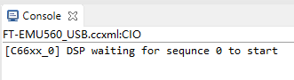

# DSP相关实验

基于FT-M6678的DSP工程。主要包括四个实验：

- 软硬件FFT对比
  - 硬件FFT测试工程 FFT_HW_Test
  - 软件FFT测试工程 FFT_SW_Test
- 双目标实时跟踪
  - Kcf_Core0 ~ Kcf_Core3
  - Kcf_Common
- 数据传输速率测试
  - Srio2Pcie
- 算法验证与评估
  - 尺度自适应(Scale Adaptive)的KCF算法 Kcf_SA
  - 尺度固定(Scale Fixed)的KCF算法 Kcf_SF
  - 两个工程分别包含纯软件实现和硬件加速的方案

## 关键点

1. FT-M6678使用时，编译器，仿真器驱动都需要打补丁。
2. 多核程序设计注意资源分配
   1. 首先分配存储资源，建立platform，熟悉每一类存储资源的容量与性质。
   2. EDMA资源的分配，中断号的分配，可以用[common.h](Kcf_Common/common.h)记录。区分CIC(cpintc)与每个内核的中断控制器intc。3个EDMA传输控制器（CC）的使用。
   3. 这部分内容与TI的文档是一致的，可以直接看[C6678](https://www.ti.com.cn/cn/lit/ds/symlink/tms320c6678.pdf)的文档。
3. SRIO相关
   1. 如何使用？从CSrioManager公有继承，完成硬件初始化。
   2. 用SRIO的DMA发送NW事务包，数据长度以字节为单位，要求为256的整数倍；接收数据会产生事先注册的门铃中断。
   3. SRIO的控制寄存器地址映射，中断相关的配置

## 环境搭建

TI的软件的下载现在都要有账号才行，如果能在官网下载推荐直接在官网下载，不行的话就用网盘上的文件。不要用学校的邮箱注册TI账号，可以用QQ邮箱注册。

1. 安装CCS软件，所有工程均已在CCS6.2.0上进行测试，更高版本的CCS可能也可以。CCS620下载地址：[官网](https://www.ti.com/tool/download/CCSTUDIO/6.2.0.00050) [百度网盘](https://pan.baidu.com/s/1qpahFXGl8LDbYl1UOu8ZpA?pwd=abcd)
2. 编译器采用TI Compiler 7.4.4 下载地址：[官网](https://software-dl.ti.com/codegen/non-esd/downloads/download_archive.htm) [百度网盘](https://pan.baidu.com/s/1FCnDubYQcH1slSyHfXVBRw?pwd=abcd)
   - 编译器为了兼容FT-M6678，官网下载的需要另外打补丁。
   - 网盘上的是已经添加了补丁的，因此不能用来编译用于TI 的DSP工程。
   - 从网盘上下载的编译器需要放在“CCS安装根目录/ccsv6/tools/compiler/”路径下
3. 如果使用CCS6.2.0 还需要添加license，将下载的license文件放在“CCS安装根目录/ccsv6/ccs_base/DebugServer/license/”路径下。下载地址：[百度网盘](https://pan.baidu.com/s/1R0FAG-DhNgThmKQyeOyBbg?pwd=abcd)
4. RTSC软件包。这些基本都是可以从官网直接下载的，不需要TI账号。如果下载不了，这里也提供网盘下载地址：[百度网盘](https://pan.baidu.com/s/1Bnwm9WrotmYAaGoBV2pX6A?pwd=abcd)
   - SYS/BIOS 6.34.4.22 下载地址：[官网](https://software-dl.ti.com/dsps/dsps_public_sw/sdo_sb/targetcontent/sysbios/index.html)
   - XDCTools 3.25.6.96 下载地址：[官网](https://software-dl.ti.com/dsps/dsps_public_sw/sdo_sb/targetcontent/rtsc/)
   - IPC 1.25.3.15 下载地址：[官网](https://software-dl.ti.com/dsps/dsps_public_sw/sdo_sb/targetcontent/rtsc/)
   - DSPLIB 3.4.0.4 下载地址：[官网链接1](https://www.ti.com.cn/tool/cn/PROCESSOR-SDK-C667X) [官网链接2](https://software-dl.ti.com/sdoemb/sdoemb_public_sw/dsplib/latest/index_FDS.html) DSPLIB在SDK里面提供的是3.4.0.4版本，也可以直接单独下载3.4.0.0版本，应该差不多。
5. 下载调试的配置文件，调试器的驱动补丁，调试用的GEL脚本都在FT-M6678随带的资料里有就不在这里提供了。

## 使用方式

1. 选择当前文件夹建立CCS workspace，**确认前面的RTSC软件包都已经安装**。
2. Project → Import CCS projects ... 导入CCS project

    

3. 先同时选中c6x_emcv和csl_m6678两个工程，分别完成Debug和Release版本的编译
   - c6x_emcv是基于OpenCV1.0移植到C6000 DSP上的OpenCV库
   - csl_m6678是FT-M6678的一些外设库

    

4. 当前两个库编译完成后，可以开始其余工程的编译，选中剩余的所有工程，依次完成Debug和Release版本的编译

    

5. 完成编译后就可以用调试器在线仿真调试
6. 程序的固化并没有做……

## 工程说明

### 软硬件FFT对比

&emsp;&emsp;FFT_SW_Test和FFT_HW_Test两个工程是类似的，都通过main.c中的宏定义来修改实验内容，比如FFT_HW_Test中的 [main.c](FFT_HW_Test/main.c) 里的宏定义是这样的：

```cpp
#define LOOP_TIMES (10) //loop times
#define FFT_GROUPS (100) // fft groups in every time
#define FFT_POW (8) // 4, 5, 6, 7, 8
```

&emsp;&emsp;FFT_SW_Test中 [main.c](FFT_SW_Test/main.c) 里的宏定义是这样的：

```cpp
#define LOOP_TIMES (10)
#define FFT_GROUPS (1)
#define FFT_LEN (256)
```

&emsp;&emsp;LOOP_TIMES用来指定重复实验的次数；FFT_GROUPS指定连续进行FFT的次数，主要对单次运算和连续的100次运算进行了实验；FFT_LEN指定FFT的长度，覆盖16~256，都是2的整数次幂。程序计时采用的是TSC寄存器，计时单位是1 ns。

&emsp;&emsp;待计算的序列中的每个值都是1，计算结果中只有索引为0的位置有值并且等于序列长度，其余位置都是0。

&emsp;&emsp;待计算序列与结果都存放在DDR3 DRAM中，计算结果会与参考结果进行对比，保证计算的正确性。

### 双目标实时跟踪

&emsp;&emsp;这个实验的测试需要通过调试器向指定的存储区域提前存放数据。具体的测试图片不提供了，可以是任意的640×512的8bit灰度图，图像的尺寸是在 [common.h](Kcf_Common/common.h) 中定义的。其它尺寸的图应该也能用，但目前仅做了少量640×512的图像的测试。


&emsp;&emsp;在上图的路径下存放以数字命名的图片，可以利用 [genDat.py](Scripts/genDat.py) 来生成用于加载到DSP里的TI格式的.dat数据文件。

[genDat.py](Scripts/genDat.py)中的参数：

```python
frame_num = 10 # max is 1069
startAddr = 0x80000000
len = (frame_num * 327680) >> 3
type = 0
```

[common.h](Kcf_Common/common.h)中的宏定义：

```cpp
#define SRC_WIDTH (640)
#define SRC_HEIGHT (512)
#define FRAME_SIZE (327680)
#define FRAME_NUM (10)
```

&emsp;&emsp;[genDat.py](Scripts/genDat.py)中的这些参数需要关注，frame_num是用于生成dat文件的图片帧数，需要和[common.h](Kcf_Common/common.h)中的宏定义一致，startAddr是[main.cpp](Kcf_Core0/src/main.cpp)中的全局变量img的地址。len是生成的dat文件中数据的个数，type用来确定数据的格式。type为0表示每行是8字节，用16进制数表示（下面有注释说明），因此len是总字节数右移三位。


&emsp;&emsp;工程编译完成后，查看.map文件找到img变量的地址。将[genDat.py](Scripts/genDat.py)中的startAddr设置成同样的值，然后运行得到images.dat文件。通过Memory Browser中的Load data的功能加载数据。把下面勾上，然后点finish就可以把数据加载进去了。


&emsp;&emsp;数据加载完成后可以看一下对应地址处的数据是否真的加载成功。


&emsp;&emsp;将四个核设成一个Group，一起运行，就可以看到类似下图中的结果。


### 数据传输速率测试

&emsp;&emsp;Srio2Pcie工程，主要用于配合上位机软件[Srio2PcieTest](../Linux/Srio2PcieTest/CMakeLists.txt)进行实验。

1. 向FPGA加载bitstream，若已经固化就可以跳过这一步
2. 上位机开机，只有FPGA中的bitstream加载完成后才能开机，否则上位机无法识别硬件。
3. 加载DSP程序，最好在FPGA中的bitstream加载完成后再启动，然后等待上位机调用。

    

4. 每完成一次测试就会显示等待下一次调用

    

### 算法验证与评估

&emsp;&emsp;Kcf_SA与Kcf_SF工程，需要配合上位机的[kcf_dsp](../Linux/tracker_benchmark_v1.1/trackers/KCF_DSP/CMakeLists.txt)软件进行实验。

1. 向FPGA加载bitstream，若已经固化就可以跳过这一步
2. 上位机开机，只有FPGA中的bitstream加载完成后才能开机，否则上位机无法识别硬件。
3. 加载DSP程序，最好在FPGA中的bitstream加载完成后再启动，然后等待上位机调用。

    

4. 每次启动调用，DSP会打印处图像序列的一些信息，比如图像的长宽，帧数，ROI的信息，每次传输的数据大小和最后传回上位机的结果数据的大小。

    

5. 完成一组序列的测试后DSP就开始等待下次调用
