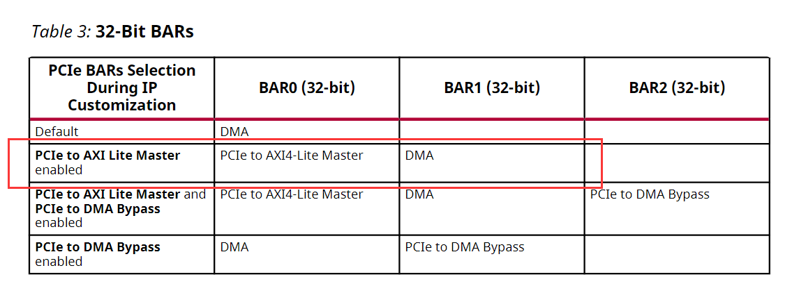
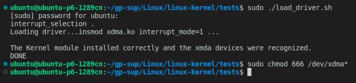
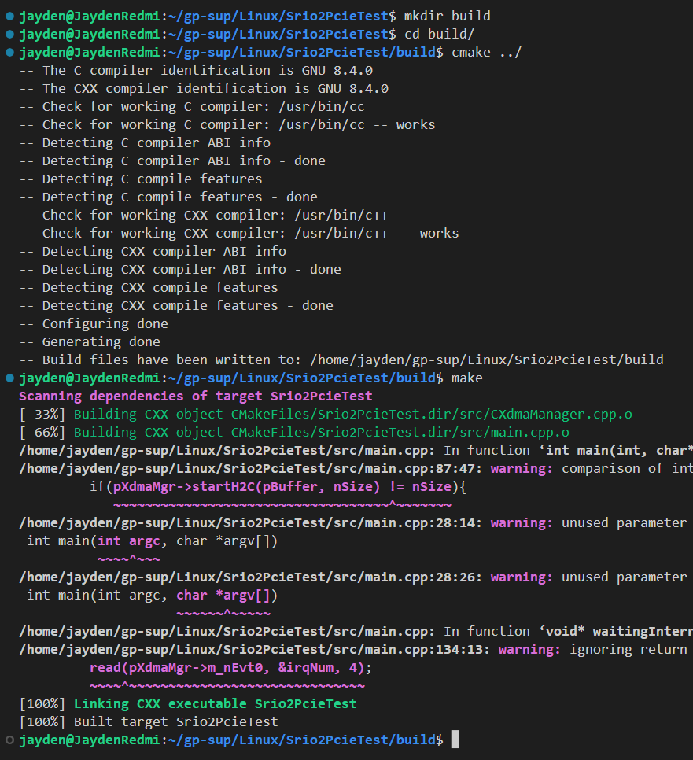
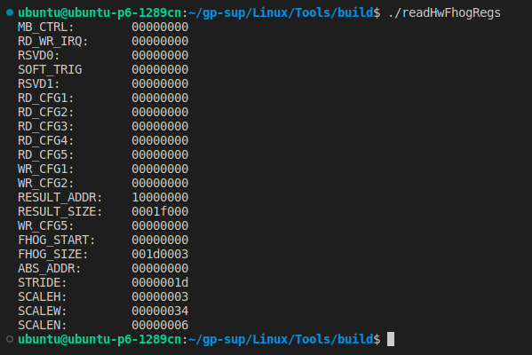
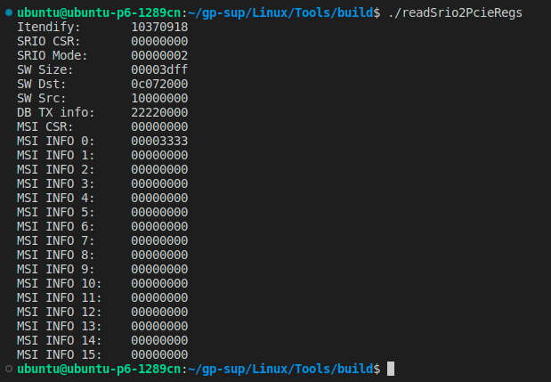
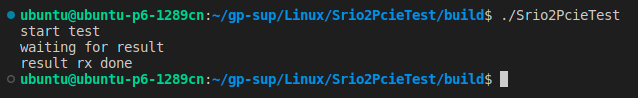
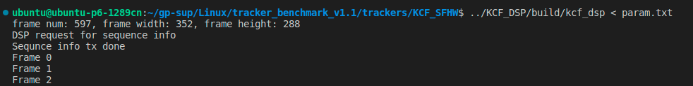
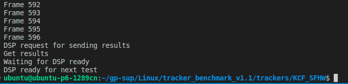

# Linux上位机程序

&emsp;&emsp;Linux上位机的程序主要包括XDMA的驱动程序，用于测试实验的程序和一些用于读寄存器的工具。所用的Linux实验环境在environment文件夹里列出。

## 关键点

1. 如何编译与加载内核驱动？
   1. 在此之前也需要对FPGA上的PCIe接口实现需要有一定了解，可以参考我的这篇[文章](https://blog.csdn.net/qq_35787848/article/details/121541957)。
   2. 在BIOS中关闭安全引导（Secure Boot），否则无法加载驱动
   3. 用lspci列出PCI设备，查看是否存在Xilinx的设备，记住设备ID，需要与load_driver.sh中的device_id一致。如果没有发现Xilinx的设备，需要检查FPGA是否正确烧写，板卡是否连接到位。
   4. 我对原版驱动做了一些修改，详见[README](linux-kernel/xdma/README.md)，直接指定config_bar的位置。

      

   5. 用load_driver.sh加载驱动，如果失败了，可以用dmesg查看内核打印的信息来查找问题。
   6. 加载驱动完成后记得改设备文件的访问权限。
2. 上位机与FPGA之间的数据收发实现方式——文件读写操作。
3. XDMA的AXI4-Lite接口访问可以直接用mmap函数映射到用户地址空间。
4. 数据集测试平台中跟踪器脚本的编写，详见[毕设论文](../Thesis/Thesis.pdf)4.2.1
5. 上位机软件与DSP软件的同步方式，详见[毕设论文](../Thesis/Thesis.pdf)4.2.3
6. 数据集测试平台的使用

## XDMA驱动程序

&emsp;&emsp;驱动程序源于[官方](https://github.com/Xilinx/dma_ip_drivers/tree/master/XDMA/linux-kernel)的驱动代码。只需要按照[readme.txt](linux-kernel/readme.txt)中的步骤完成编译和加载驱动即可。值得注意的是，xdma驱动的编译是依赖内核源码树的，因此需要用sudo make install，而不是make install。运行[load_driver.sh](linux-kernel/tests/load_driver.sh)也需要加上sudo。



&emsp;&emsp;加载驱动的结果类似这样，后面改一下设备的访问权限，方便后续应用程序访问。

```sh
sudo chmod 666 /dev/xdma*
```

## 应用程序

### 编译

&emsp;&emsp;所有应用程序的编译由CMake管理。[kcf_dsp](tracker_benchmark_v1.1/trackers/KCF_DSP/CMakeLists.txt)依赖OpenCV，我用的是3.4.8版本，其它版本的OpenCV应该也可以。所以需要系统中已经用CMake编译完成的OpenCV，源码下载[官网](https://opencv.org/releases/)。



&emsp;&emsp;编译过程都是类似的，先利用CMake生成Makefile，再make生成可执行文件。

### 读寄存器的工具

&emsp;&emsp;readSrio2PcieRegs和readHwFhogRegs是主要的两个读寄存器的工具，分别读Srio2PcieBridge和HwFhog硬件加速电路的控制寄存器。在这个[CMakeLists.txt](Tools/CMakeLists.txt)里给出。




### 数据传输速率测试

&emsp;&emsp;[Srio2PcieTest](Srio2PcieTest/CMakeLists.txt)是用于配合DSP完成测试的应用程序。运行结束后会在运行的目录下生成一个results.txt文件，其中记录了不同长度的数据量收发所用的时间，以ns为单位。具体使用方式需要参考DSP工程的[README](../DSP/README.md)



### 跟踪算法序列测试程序

&emsp;&emsp;序列测试用到的param.txt文件由Matlab生成，将[kcf_dsp](tracker_benchmark_v1.1/trackers/KCF_DSP/CMakeLists.txt)的标准输入流重定向为param.txt，kcf_dsp自动读取图片，转换成单通道灰度图像，发送至DSP。最后从DSP收到跟踪结果，写入results.txt文件，Matlab根据results.txt保存跟踪结果。具体使用方式需要参考DSP工程的[README](../DSP/README.md)




&emsp;&emsp;四种不同的跟踪算法KCF_SFSW，KCF_SFHW，KCF_SASW，KCF_SAHW都用kcf_dsp实现上位机与DSP之间的通信。

## 跟踪算法验证评估平台

&emsp;&emsp;Matlab上的验证平台根据[UAV123](https://cemse.kaust.edu.sa/ivul/uav123)的测试平台修改。测试平台在Windows与Linux环境下是通用的。

### 依赖

- data_seq
- vlfeat-0.9.21

&emsp;&emsp;主要依赖数据集的测试序列，和[vlfeat](https://www.vlfeat.org/)。后者很容易在官网下载到，放在与tracker_benchmark_v1.1同级的目录下即可。数据集序列的路径要与[dataSetSetting](tracker_benchmark_v1.1/util/dataSetSetting.m)中的设置一致。

### 配置

&emsp;&emsp;[dataSetSetting](tracker_benchmark_v1.1/util/dataSetSetting.m)中要改的就是parent_loc和data_set。可以用来在OTB100和UAV123数据集上进行测试。

```matlab
dataSet = 'OTB100';
% dataSet = 'UAV123';

% Linux
parent_loc = '/home/ubuntu/gp-sup/Linux'; % no slash at the end!

% Windows
% parent_loc = 'D:/Algorithm/UAV123_OTB100'; % no slash at the end!
```

### 测试结果

&emsp;&emsp;DSP上算法测试的结果保存在tracker_benchmark_v1.1/results目录下。

- [KCF_SAHW_results.zip](tracker_benchmark_v1.1/results/KCF_SAHW_results.zip)
- [KCF_SASW_results.zip](tracker_benchmark_v1.1/results/KCF_SASW_results.zip)
- [KCF_SFHW_results.zip](tracker_benchmark_v1.1/results/KCF_SFHW_results.zip)
- [KCF_SFSW_results.zip](tracker_benchmark_v1.1/results/KCF_SFSW_results.zip)
