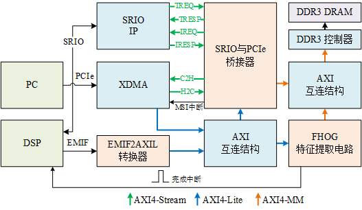

# FPGA逻辑电路设计

&emsp;&emsp;工程名称：PcDspBridge，PC和DSP之间的Bridge。主要为了实现DSP与FPGA的高速数据传输。PC通过PCIe与FPGA交互数据，DSP通过SRIO与FPGA交互数据。本设计中的EMIF2AXIL转换器能够让DSP直接读写FPGA内的寄存器，SRIO与PCIe桥接器可以实现DSP与PC之间以数据流的形式传输数据。另外带有FHOG特征提取硬件加速电路，用于DSP内的算法加速。

## 系统框图



## 使用方法

依赖Vivado 2019.2，其它版本会出问题。

1. 如果环境变量Path中有vivado的路径，可以直接通过build.bat建立工程
   如果Path环境变量里没有vivado的路径，也可以启动Vivado，在Tcl Console里可以先用pwd查看当前路径，然后cd切换到本目录，再用source命令执行脚本。

    ```tcl
    source build.tcl
    ```

2. 如果用的是复旦微电的FPGA，需要加patch；
3. 先OOC综合；
4. 接着综合实现后生成bitstream文件。
